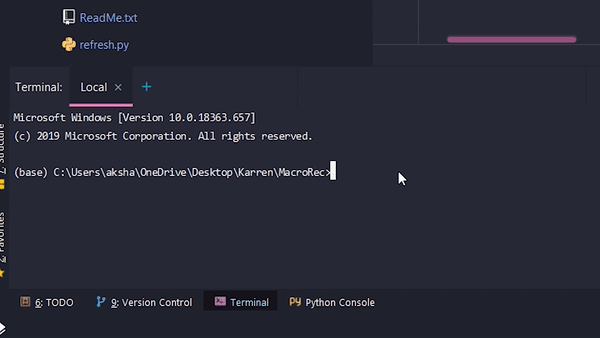

This is the steps repeater or macro maker.
Simply clone the code and install the needed modules, then run the repeater.py file. Then type in the amount of seconds you want to record. If you don't know how much time you will record simply enter a very large value and press Esc key whenever you are done recording.
Then just give the recording a name like macro1, which then saves it to the same directory where repeater.py is stored. Then simply execute macro1.py to repeat the steps. It also has a facility to play at different speeds.
The feature to loop is also there, so you can now loop the recordings when you play them.
Example :

